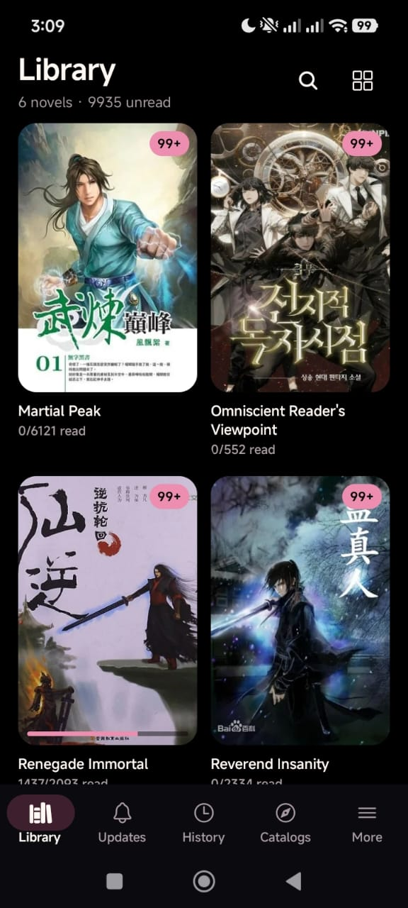
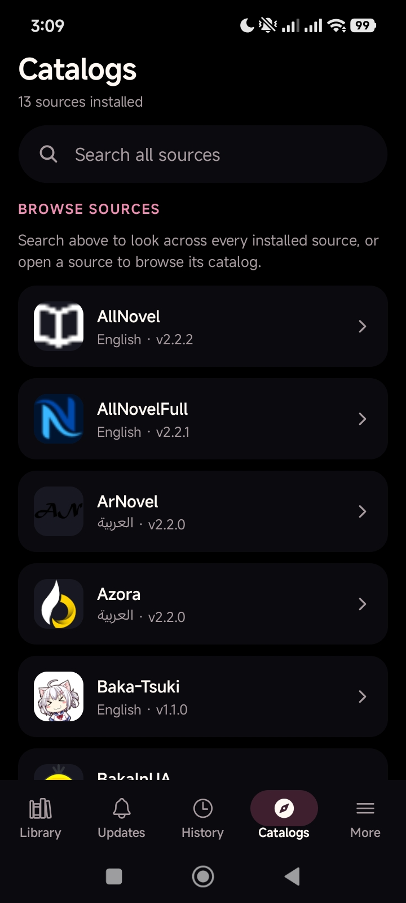
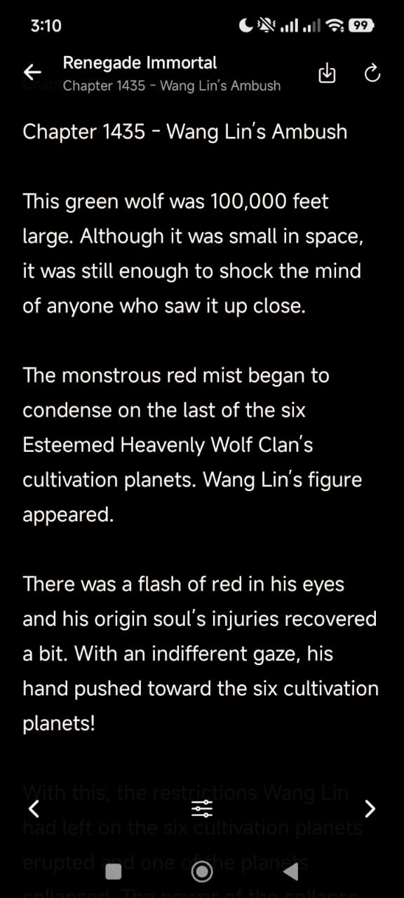

<div align="center">


# Honya

### A Lightweight, Plugin-Based Web Novel Reader

A minimal, offline-first novel reader built with **React Native and Expo**, featuring Material Design 3–inspired theming, an LNReader-compatible plugin engine, and full offline reading support. Honya ships with zero built-in sources — every source comes from a plugin repository you add yourself.


[](https://github.com/TheDeadShadow47/Honya/releases)

</div>

---

## 📸 Screenshots

<p align="center">
  
  
  
</p>

---

## 📖 Overview

Honya turns novel reading into a clean, self-contained mobile experience — no bundled sources, no bloat. Every extension is fetched from a plugin repository you choose, downloaded only when you tap **Install**, and evaluated in a sandboxed runtime so you stay in control of what code runs on your device.

Under the hood, Honya pairs an LNReader-compatible plugin engine with a hand-rolled Material Design 3 token system, a WAL-mode SQLite database for offline storage, and a Zustand store to keep the whole app in sync.

---

## ✨ Features

- 📜 **Continuous scrolling reader** — chapters load automatically as you scroll, no "Next" button required
- 📥 **Reliable background downloads** — long download batches keep processing even when Honya is in the background, and stay in sync with Download Manager
- ⬇️ **Download Manager** — track, pause, and cancel queued chapter downloads
- 📶 **Offline reading** — read downloaded chapters without a connection; progress saved locally via SQLite
- 🔄 **Automatic & manual library updates** — keep your library in sync with the latest chapters, smooth even for large libraries
- 🔔 **Notifications** — download / update progress and results, keeping background activity visible without requiring the app to stay open
- 🕐 **In-app updates** — check for new versions, download updates, and launch the Android installation flow from inside Honya
- 🔖 **Per-chapter progress** — scroll position and read status tracked per chapter
- ✅ **Advanced chapter selection** — long-press for bulk download, mark, or remove
- 🔍 **Filter / sort / display** — downloaded-unread filters, sort by number or date, toggle row metadata
- 🎚 **Reading customization** — font size, line height, padding, and 5 reader background presets
- 📚 **Library** — grid view with unread badges, progress bars, and search
- 🆕 **Updates feed** — chronological new-chapter list, grouped by day
- 🕘 **History** — recently read chapters sorted by last-read time
- 🧩 **Plugin repository system** — add any number of repositories via URL
- ⚙️ **LNReader-compatible engine** — sandboxed runtime using `cheerio`, `htmlparser2`, `dayjs`, and a fixed shim table
- 🎨 **15 built-in themes** — dark, light, and OLED color schemes for every taste
- 🌍 **Five languages** — English, Français, العربية, Deutsch, and Italiano, with Arabic RTL support
- 🚀 **Performance tuned** — smooth and responsive even with large libraries and long chapter lists
- 🚫 **No default sources** — every extension is user-provided, nothing runs until you install it

---

## 🆕 What's New in 1.4.0

- 🚀 **Expo SDK 57** — Honya's underlying Expo / React Native stack was modernized for better compatibility with newer Android versions and the latest APIs and dependencies.
- 📥 **More reliable background downloads** — sequential download queues keep processing reliably in the background, and progress stays synchronized with the Download Manager even when the app isn't in the foreground.
- 🔄 **Improved library updates** — faster, more reliable manual and automatic library updates that handle large libraries cleanly with better progress and state reporting.
- 🌍 **German & Italian** — two new UI languages, for five total (English, Français, العربية, Deutsch, Italiano); Arabic RTL support is preserved.
- ⚡ **Performance improvements** — snappier filtering and scrolling in large chapter lists, with smoother read/download state synchronization.
- 🛠️ **Codebase cleanup** — updated APIs, removed deprecated code, and improved project consistency following the migration.

---

## 🎨 Theming

Honya ships with 15 built-in themes — dark, light, OLED, and colorful options for every taste — switchable from **Settings → Theme**:

| Theme | Description |
|---|---|
| **Honya Sakura** (default) | Pure black background, sakura pink accents |
| **Midnight** | Balanced dark |
| **Daylight** | Clean light |
| **Onyx** | Pure black OLED |
| **Forest** | Earthy green tones |
| **Blossom** | Soft rose light |
| **Ocean** | Deep blue underwater tones |
| **Amethyst** | Rich purple jewel tones |
| **Ember** | Warm ember glow |
| **Arctic** | Crisp cool light theme |
| **Coffee** | Warm cozy brown tones |
| **Sage** | Calm muted green tones |
| **Rosewood** | Deep burgundy tones |
| **Parchment** | Warm vintage paper tones |
| **Lemon** | Warm golden yellow tones |

Every UI element reads from a single `THEMES` table (`background`, `surface`, `surface1–3`, `outline`, `primary`, `text`, `textMuted`, `error`, …) with automatic dark/light status-bar detection. Reader backgrounds are independent of the app theme, each with their own foreground color for readability.

---

## 🌍 Languages

Honya's interface is available in **five languages**, switchable from **Settings → Language**:

| Language | Code |
|---|---|
| English 🇬🇧 | `en` |
| Français 🇫🇷 | `fr` |
| العربية 🇸🇦 | `ar` |
| Deutsch 🇩🇪 | `de` |
| Italiano 🇮🇹 | `it` |

**Deutsch and Italiano were added in v1.4.0**, joining English, French, and Arabic. Arabic is fully supported with **RTL (right-to-left) layout**.

---

## 🛠 Tech Stack

| Layer | Choice |
|---|---|
| Framework | Expo SDK 57 · React Native 0.86.3 · React 19.2.3 |
| Navigation | Expo Router v6 (file-based) |
| State | Zustand v5 with AsyncStorage persistence |
| Database | expo-sqlite v16 (WAL mode, serialized I/O) |
| Animations | react-native-reanimated v4 + gesture-handler v2 |
| UI | Hand-rolled Material Design 3 token system (`theme/theme.js`) |
| Plugin engine | Sandboxed `new Function` with fixed shim table |

---

## 📂 Project Structure

```text
app/
  _layout.js                  Root layout — splash, status bar, Stack navigator
  (tabs)/                     Tab group (Library · Updates · History · Catalogs · More)
    _layout.js                5-tab bottom nav with M3 pill indicator
    index.js                  Library screen
    updates.js                Recent-chapter updates feed
    history.js                Recently read chapters
    catalogs.js               Installed extensions + global search
    more.js                   Link-out to settings screens
  novel/
    [id].js                   Novel detail — cover, summary, chapter list
    migrate.js                Import-migrate screen (for LNReader data)
  reader/
    [chapterId].js            Reader screen — segmented text, scroll progress, offline fallback
  browse/
    [pluginId].js             Extension browse/search screen
  settings/
    repositories.js
    extensions.js
    language.js
    theme.js
    reader.js
    storage.js
    about.js

components/
  MD3.js                      Material Design 3 primitives: Surface, Button, Chip,
                              Dialog, Field, SearchBar, EmptyState, Skeleton,
                              Divider, IconButton, ProgressBar, Badge, etc.
  BottomSheet.js              Reusable animated bottom sheet (native driver)
  ChapterManageSheet.js       Filter / Sort / Display tabs for the chapter list
  ChapterRow.js               Memoized chapter row (read dot, progress bar, download btn)
  Cover.js                    Image cover with loading / error fallback
  HistoryRow.js               Single row in the history list
  NovelCard.js                Grid card for library/catalog items
  NovelHeader.js              Novel detail header (cover + metadata + resume button)
  Ripple.js                   Touch-feedback wrapper
  SelectionBar.js             Contextual app bar during chapter multi-select

db/
  database.js                 SQLite wrapper — init, schema, all CRUD for novels,
                              chapters, plugins; WAL mode; I/O serialization queue

hooks/
  useAppTheme.js              Returns the active THEMES entry from Zustand prefs
  useI18n.js                  Returns the current locale's `t()` translate function

lib/
  pluginEngine.js             LNReader-compatible sandboxed new Function runtime
  repository.js               fetchRepository() + normalizePlugin()
  clean.js                    HTML → plain-text strip + entity decode
  chapterPrefs.js             Per-novel filter/sort/display persistence
  chapterMatch.js             Chapter ID matching helpers
  migrate.js                  LNReader data migration utility
  time.js                    groupByDay() + relativeTime() formatting
  i18n.js                    Translation lookup (en/ar/fr/de/it), RTL detection
  navIds.js                  Encodes/decodes novel/chapter IDs for navigation
  locales/                   Per-language translation tables (en, ar, fr, de, it)
  downloadQueue.js           Background download queue manager (persistent, sequential)
  libraryUpdate.js           Manual + automatic library update coordinator
  notifications.js           Notification channels, prefs, and send helper
  updateManager.js           In-app update checker + APK download/install
  backgroundTasks.js         Registered background task handlers

store/
  useStore.js                 Zustand store — prefs, repos, extensions, library,
                              updates, history, downloads, global search

theme/
  theme.js                    THEMES object (15 themes), READER_BACKGROUNDS, shared
                              layout tokens (RADIUS, SPACING, TYPE, TOUCH, ELEVATION)

assets/
  icon.png                    2048×2048 app icon
  splash.png                  Splash screen image
```

---

## 🧩 Plugin Engine

Honya uses a sandboxed `new Function(...)` runtime. Plugin code runs with shadowed globals — `process`, `global`, `globalThis`, `window`, `document`, `__DEV__` — so it cannot reach the native environment. The only allowed `require()` calls are:

| Module | Source |
|---|---|
| `cheerio` | NPM (`cheerio@^1.2.0`, slim build) |
| `htmlparser2` | NPM (`htmlparser2@^12.0.0`) |
| `dayjs` | NPM (`dayjs@^1.11.21`) |
| `@libs/fetch` | Built-in `fetch` shim |
| `@libs/storage` | Async Storage shim |
| `@libs/novelStatus` | Read-status helper |
| `@libs/defaultCover` | Fallback cover helper |
| `@libs/filterInputs` | Input-sanitization helper |
| `@libs/isAbsoluteUrl` | URL validation helper |
| `@libs/aes` | AES decryption helper |

Plugins expose a standard API (`popular()`, `latest()`, `search()`, `novel()`, `chapter()`) and are identified by a unique `id` string. The app resolves the right method name by trying a candidate list and returning the first that matches.

---

## 🚀 Getting Started

Clone the repository

```bash
git clone https://github.com/TheDeadShadow47/Honya.git
```

Enter the project directory

```bash
cd honya
```

Install dependencies

```bash
npm install
```

Run the app

```bash
npx expo start          # Start dev server (QR code)
npm run android         # Launch on connected Android device
npm run ios             # Launch on connected iOS device / simulator
```

---

## 🔌 Adding a Plugin Repository

1. Open **More → Repositories**
2. Paste a full `https://…` URL pointing to a JSON repository catalog
3. Tap **Add** — the app validates the URL and stores the repo
4. Go to **More → Extensions** to see extensions from that repo
5. Tap **Install** on any extension to download and evaluate its code

The app has no default repositories — every source is user-provided.

---

## 💾 Storage & Data

- **SQLite database** — `expo-sqlite` with WAL mode, busy timeout, and a serialized I/O queue to prevent `SQLITE_BUSY`
- **AsyncStorage prefs** — user preferences (theme, reader settings, repository list) persisted as JSON
- **Chapter-prefs cache** — per-novel filter/sort/display settings loaded synchronously on mount to avoid a flash of defaults
- **Storage management** — Settings → Storage screen shows database size, per-table row counts, and a clear-downloads button

---

## ⚙️ Settings

| Screen | What it does |
|---|---|
| Repositories | Add / remove plugin repository URLs |
| Extensions | List installed extensions; install new ones from repos |
| Language | Switch the UI between English, العربية, Français, Deutsch, and Italiano |
| Theme | Pick one of 15 color themes |
| Reader settings | Font size, line height, padding, background |
| Storage | Database stats, clear downloaded chapters |
| About | App version and license |

---

## 🔮 Future Improvements

Potential additions include:

- Additional built-in themes
- Backup / restore for library and progress
- Reading statistics
- Custom plugin repository health checks
- Tablet-optimized layouts

---

## 📄 License

This project is available under the **MIT License**.

---

## 🙏 Credits

### LNReader

Honya supports the **LNReader-compatible plugin and extension ecosystem**. We gratefully acknowledge the [LNReader](https://github.com/LNReader/lnreader) project and its contributors for the plugin architecture — including the manifest format, the extension API surface, and the shared helper modules — that make this possible.

LNReader's plugin architecture is what allows community-maintained source extensions to work across multiple apps.

### Expo

Built with the [Expo](https://expo.dev) platform and its open-source SDK.

---

<div align="center">

### 📖 "Every story deserves a good reader."

Built with ❤️ for offline-first reading.

</div>